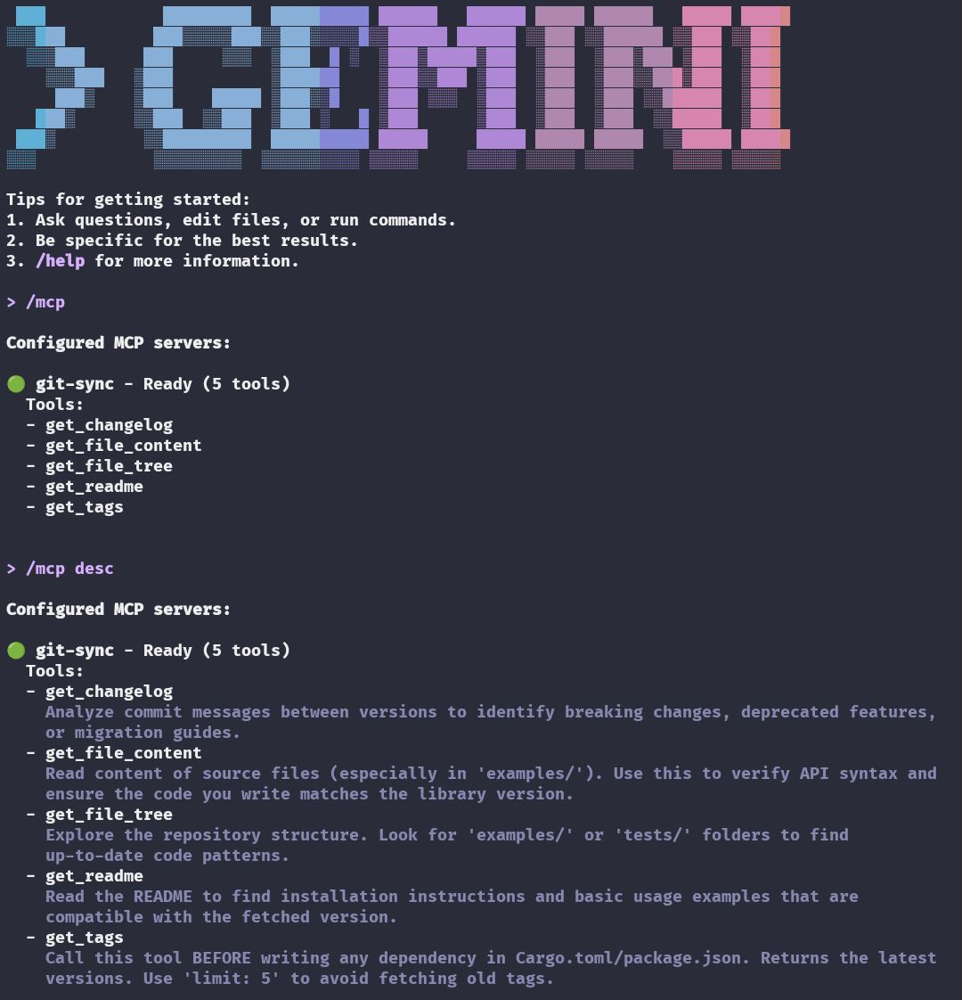
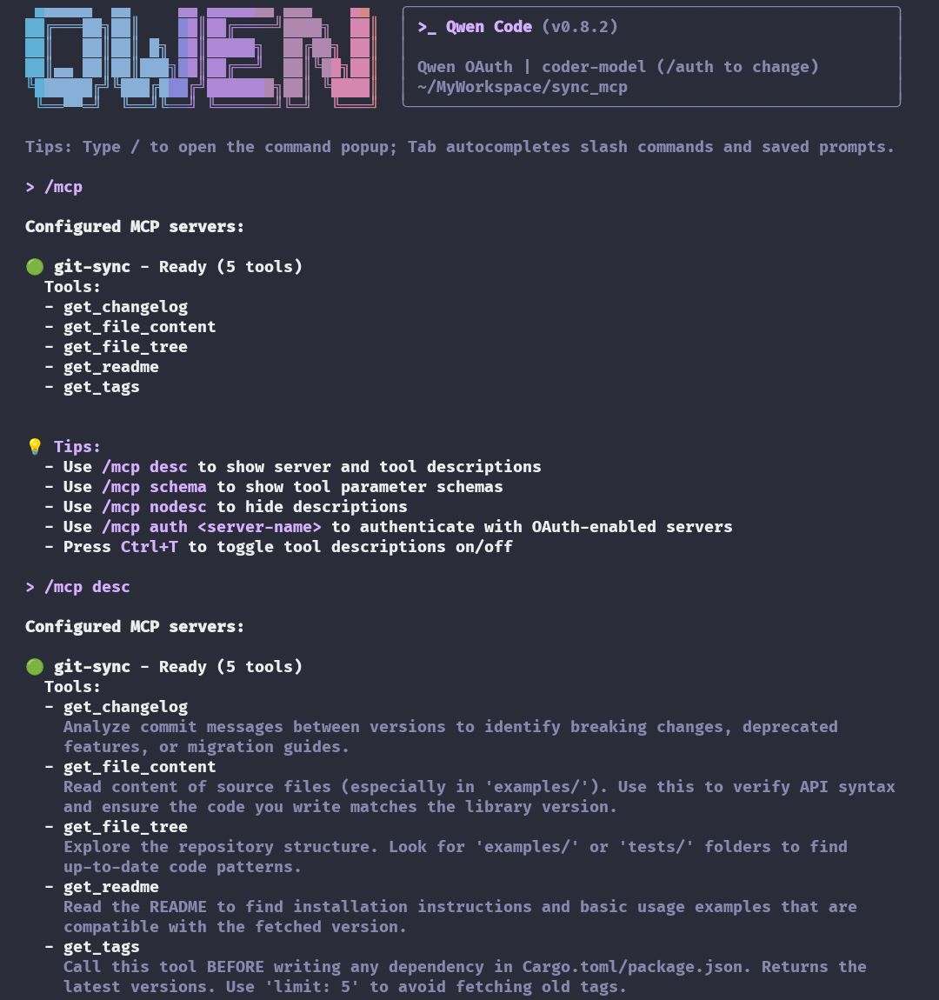
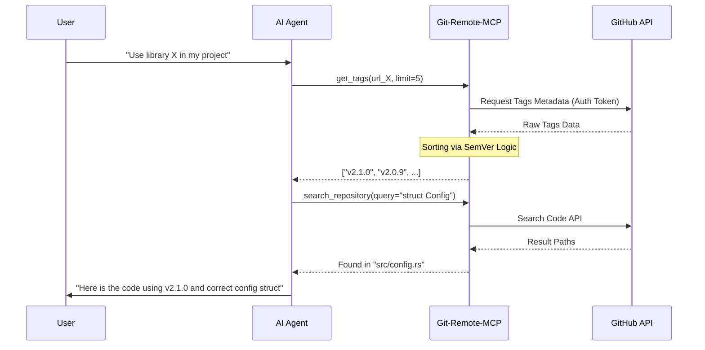

# Git MCP Go

[](https://go.dev/)
[](https://modelcontextprotocol.io/)
[](LICENSE)

---

**Git Remote MCP** is a high-performance Model Context Protocol (MCP) server written in Go. It empowers AI Agents (Claude Desktop, Gemini CLI, Cursor, Qwen) to explore, search, and analyze GitHub repositories in **real-time** without the need for local cloning.

### The Problem It Solves
AI models often suffer from a "knowledge cutoff" or hallucinate library versions. This tool provides **Real-Time Context**:
- **Outdated Dependencies:** AI can fetch the absolute latest SemVer-sorted tags to recommend up-to-date libraries.
- **Context Gap:** AI can "read" remote source code, file structures, and documentation to understand libraries it wasn't trained on.
- **Blind Coding:** Instead of guessing APIs, the AI can search and read the actual implementation in the repository.

| Gemini CLI in Action | Qwen CLI in Action |
|:--------------------:|:------------------:|
|  |  |

---

## Why Go?

1. **Zero System Dependencies:** No OpenSSL or C-bindings required (unlike `reqwest` in Rust which can have cross-compilation issues).
2. **Super Fast Compilation:** Rebuilds complete in under 0.5 seconds.
3. **Easy Cross-Compilation:** Build for any platform with simple `GOOS/GOARCH` environment variables.
4. **Concurrency Ready:** Future features can leverage Go's `goroutines` for parallel repository operations.

---

## Features

- **Zero-Clone Exploration:** Fetch trees, files, and metadata via GitHub API instantly.
- **Smart Dependency Solving**: Fetches and sorts tags by **Semantic Versioning (SemVer)**, ensuring the AI suggests the *actual* latest version.
- **Semantic Search:** Find functions, structs, or text across the entire repository using GitHub's Search API.
- **Secure & Scalable**: Natively supports `GITHUB_TOKEN` authentication to increase API rate limits from 60 to **5,000 requests/hour**.
- **Multi-Arch Support**: Cross-compile for `x86_64`, `aarch64` (ARM64), and `armv7` easily.

---

## Tools Available for AI

| Tool | Description |
|------|-------------|
| `get_tags` | Returns latest tags/versions. Supports `limit` and **SemVer sorting** (e.g., `v1.10` > `v1.9`). |
| `search_repository` | Search for code, specific functions, or text definitions within the repo. |
| `get_file_tree` | Recursively lists files to reveal project architecture/structure. |
| `get_file_content` | Reads the raw content of specific files from any branch/tag. |
| `get_readme` | Automatically fetches the default README for a quick project overview. |
| `get_changelog` | Compares two tags and returns a summary of commit messages. |

---

## Visualizing the Data Flow



---

## Installation

### Option A: Quick Install (Binary)
Install the pre-compiled binary for your OS and Architecture (`Linux x86_64/aarch64/armv7` or `macOS Intel/Silicon`):

```bash
curl -fsSL https://raw.githubusercontent.com/HanSoBored/git-mcp-go/main/install.sh | bash
```

### Option B: Build from Source (Go)

Requires Go 1.21+:

```bash
git clone https://github.com/HanSoBored/git-mcp-go.git
cd git-mcp-go
./build.sh
```

### Option C: Manual Build

```bash
go mod download
go build -ldflags="-s -w" -o git_mcp

# Cross-compile for Linux x86_64
GOOS=linux GOARCH=amd64 go build -ldflags="-s -w" -o git_mcp_linux_amd64

# Cross-compile for macOS ARM64
GOOS=darwin GOARCH=arm64 go build -ldflags="-s -w" -o git_mcp_darwin_arm64
```

---

## Configuration

Add this to your MCP client configuration (Claude Desktop, Cursor, Gemini CLI, etc.):

```json
{
  "mcpServers": {
    "git-remote": {
      "command": "/usr/local/bin/git_mcp",
      "args": [],
      "env": {
        "GITHUB_TOKEN": "ghp_your_personal_access_token_here"
      }
    }
  }
}
```

**Important:** Adding a `GITHUB_TOKEN` is highly recommended to avoid the 60 requests/hour rate limit. With authentication, you get **5,000 requests/hour**.

---

## System Prompt for AI Agents

To maximize the utility of this MCP, add this to your Agent's system instructions:

```text
You are equipped with the 'git-remote' MCP toolset.
1. When asked about a library/dependency, ALWAYS use 'get_tags' with 'limit: 5' to verify the latest version. Do not guess.
2. Before suggesting implementation details, use 'search_repository' to find relevant code definitions (structs, functions).
3. Use 'get_file_content' to read the actual code context before answering.
4. If a user asks about a project structure, use 'get_file_tree'.
```

---

## Example Usage

### Check Latest Version
```
User: "What's the latest version of clap?"
AI: [Calls get_tags with url="https://github.com/clap-rs/clap", limit=5]
AI: "The latest version is v4.5.59"
```

### Search for Code
```
User: "How does this project handle dlopen?"
AI: [Calls search_repository with query="dlopen"]
AI: [Calls get_file_content to read the relevant file]
AI: "Here's how dlopen is handled..."
```

---

## License

MIT License. Feel free to use and contribute!
